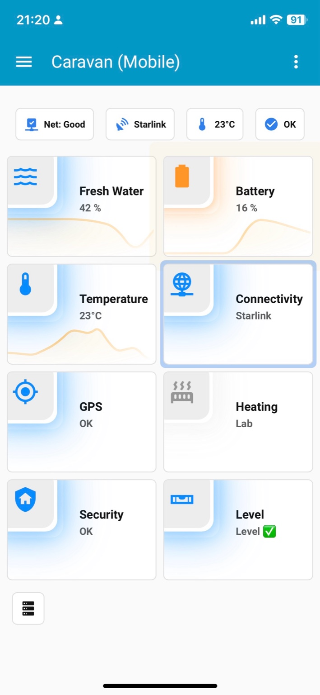

# Caravan Mobile – Start Page (Dashboard Module)

This folder contains the **Lovelace start page** for the **Caravan (Mobile)** dashboard, published in a way that is safe to share:
- No personal device names
- No coordinates / location data
- No secrets

## Screenshot

## What this start page is for

The start page is the primary **mobile-first** dashboard when traveling.  
It is optimized for:
- phones and tablets
- large, high-contrast UI elements
- quick recognition and minimal interaction

Typical tiles include: Water, Battery, Temperature, Connectivity (Starlink/LTE), GPS, Heating, Security, and Leveling.

## Prerequisites (UI-only)

Install the following **frontend** components via HACS **to render this view correctly**:

### Required
- Mushroom (cards)
- card-mod

### Optional (only if used by this view)
- mini-graph-card (for embedded tile graphs)
- vertical-stack-in-card (for stacked layouts)
- bar-card (for bar visuals)

## Theme

This view expects the theme **Mushroom Square**.

Recommended: **Light** mode.  
Also supported: **Dark** or **Auto** (Home Assistant appearance settings).

## How to use

1. Copy the view YAML into your dashboard:
   - `start-page.view.yaml`
2. Ensure the HACS prerequisites are installed and resources loaded.
3. Map entities to your installation:
   - See `ENTITY_MAP.md`

## Files

- `start-page.view.yaml` – the sanitised Lovelace view YAML
- `ENTITY_MAP.md` – entity mapping and notes
