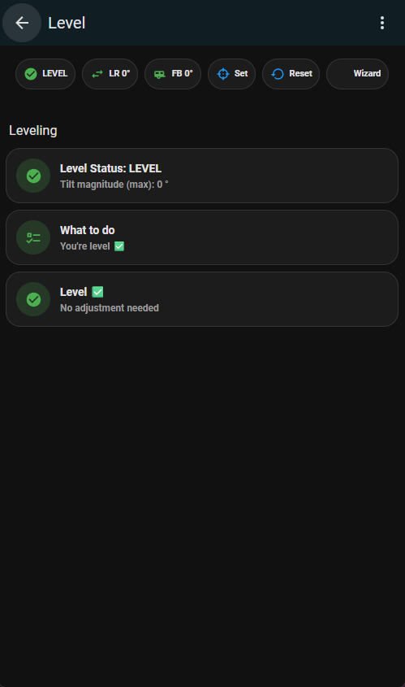
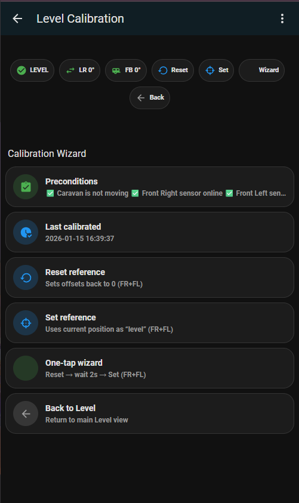
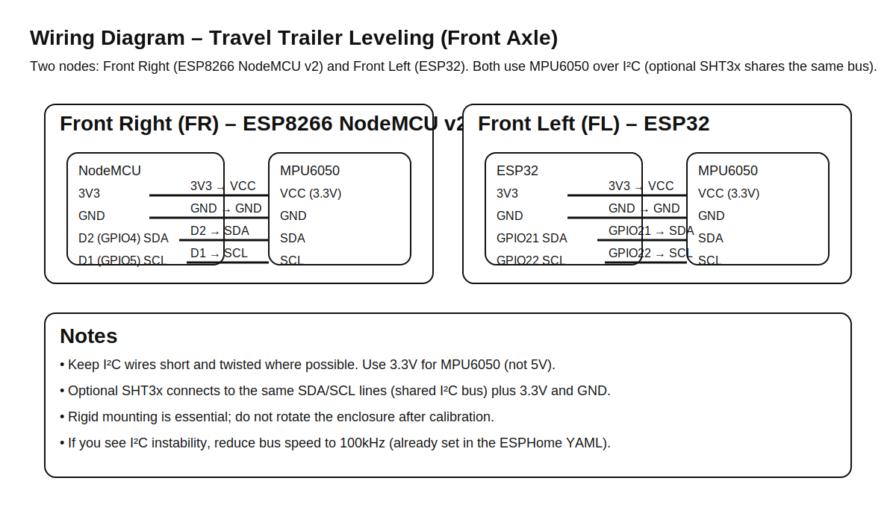

# 🚐 Travel Trailer Leveling (Front Axle) – Home Assistant Package

**Repository:** `caravan-home-assistant`  
**Package:** `caravan_leveling`  
**Version:** `v1.0.0`  
**Scope:** **Travel trailers / caravans with a single axle (two wheels)**

This package provides a calibrated leveling system using **two IMU sensors**:
- **Front Left (FL)** – mounted just in front of the left tire
- **Front Right (FR)** – mounted just in front of the right tire

It produces a single combined front-axle leveling status (**LEVEL / ATTENTION / ALARM**), plus actionable guidance and a calibration wizard.

---

## 📸 Screenshots

### Level (main)


### Calibration Wizard


---

## 🧾 Wiring Diagram (SVG)



---

## 🧰 Hardware Used

### Front Right (FR)
- **MCU:** ESP8266 NodeMCU v2  
- **IMU:** GY-521 / **MPU6050** (I²C)  
- **Optional ambient sensor:** **SHT3x** (I²C, shared bus)  
- **Enclosure:** Custom 3D-printed case + top (STL)

### Front Left (FL)
- **MCU:** **ESP32 Dev Module**  
- **IMU:** GY-521 / **MPU6050** (I²C)  
- **Optional ambient sensor:** **SHT3x** (I²C, shared bus)  
- **Enclosure:** Custom 3D-printed case + top (STL)

---

## ✅ Home Assistant Prerequisites

- Home Assistant **2024.10+**
- ESPHome **2024.12+**
- YAML configuration enabled

---

## 📦 HACS Frontend Plugins (Required)

Install via **HACS → Frontend**:

- Mushroom Cards  
  https://github.com/piitaya/lovelace-mushroom

- bar-card  
  https://github.com/custom-cards/bar-card

- card-mod  
  https://github.com/thomasloven/lovelace-card-mod

Restart Home Assistant after installation.

---

## 📦 Install via HACS (as a Package Repo)

This repository is structured so HACS can install it as a **custom integration** (wrapper), while the actual functionality lives in YAML packages / blueprints / Lovelace YAML / ESPHome YAML.

### Steps
1. In Home Assistant, open **HACS → Integrations**
2. **⋮ (top right) → Custom repositories**
3. Add your repository URL and choose category **Integration**
4. Install **Caravan Leveling (Travel Trailer)**
5. Restart Home Assistant

> The integration is a wrapper to make the repo HACS-installable. You still need to copy the YAML package into your config (next section).

---

## 🧩 Installation (HA YAML Package)

1. Copy this folder to your HA config:
   ```
   packages/caravan_leveling/
   ```

2. Enable packages in `configuration.yaml` (once):
   ```yaml
   homeassistant:
     packages: !include_dir_named packages
   ```

3. Restart Home Assistant

---

## 🧩 Auto‑Discovery Instructions (ESPHome → Stable Entity IDs)

To make this package work out-of-the-box, the ESPHome nodes must produce the expected entity IDs.

### Recommended approach (best)
- Use the ESPHome YAML files shipped in `esphome/`:
  - `esphome/caravan_level_front_right_fr.yaml`
  - `esphome/caravan_level_front_left_fl.yaml`

These names ensure Home Assistant creates the expected entities, e.g.:
- `sensor.caravan_level_front_right_fr_pitch_level_ref`
- `sensor.caravan_level_front_left_fl_pitch_level_ref`
- (and their roll / tilt / buttons)

### If you already have devices
Rename the ESPHome device names to match:
- `caravan_level_front_right_fr`
- `caravan_level_front_left_fl`

Then either:
- restart Home Assistant, or
- remove and re-add the ESPHome device if entity IDs are not regenerated as expected.

---

## 🖥 Lovelace UI

Import the views from:
- `lovelace/caravan-level.yaml`
- `lovelace/caravan-level-calibration.yaml`

---

## 🔔 Notifications (Blueprint)

Blueprint included:
- `blueprints/automation/caravan_leveling_notify.yaml`

It notifies on **ATTENTION / ALARM** (optional recovered-to-LEVEL), supports:
- suppression while moving
- simple cooldown
- includes a dashboard path in the message

---

## 🧱 3D-Printed Enclosure (STL)

Place your files here:
```
stl/
├─ caravan_level_sensor_case.stl
└─ caravan_level_sensor_top.stl
```

Printing recommendations:
- PETG or ABS (PLA not recommended for caravans)
- 0.2 mm layer height, ≥3 perimeters
- Rigid mounting (no foam between IMU and case)

---

## 🚫 Scope (By Design)

This project is intentionally limited to **travel trailers / caravans with a single axle**.  
No 4-point or motorized leveling systems are supported or planned.

---

## Versioning

- **v1.0.0** – Front axle leveling (FL + FR), calibration wizard, Lovelace UI
