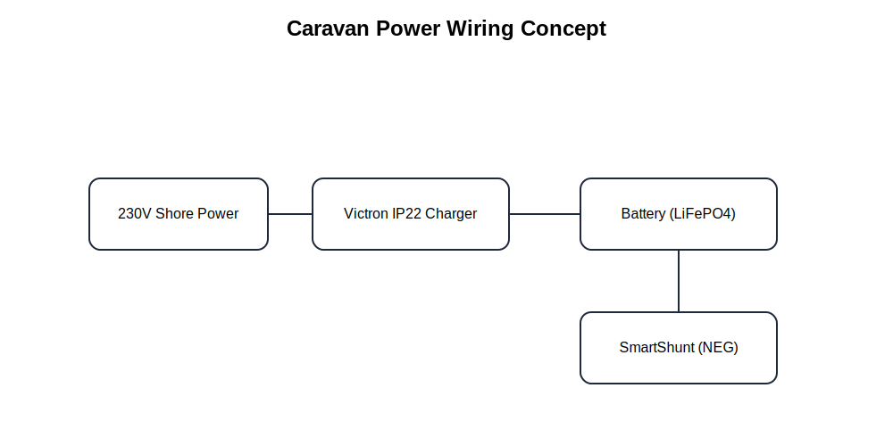

# Travel Trailer Power (Victron) – Home Assistant Package
**Repository:** `caravan-home-assistant`
**Package:** `caravan_power`
**Version:** `v1.0.0`
**Scope:** **Travel trailers / caravans with Victron BLE devices (SmartShunt + IP22) and optional BMS**
**Project root:** https://github.com/DanStasiak/caravan-home-assistant

This package provides a **canonical battery abstraction layer** (**Voltage / Current / Power / SoC / TTG**), **power source intelligence** (**Mains / Alternator / Battery**), **BLE freshness protection**, and **alerting** for real-world caravan deployments.

> ⚠️ This is a **monitoring + alerting system**
> ❌ No actuator control
> ❌ No inverter / 230V load management (yet)
> ✅ Designed for low DB churn (“Reduce Sensor Logging DB” pattern)

---

## Screenshots

### Power (subview)


### Charging


---

## Architecture (Power Package)

```text
┌───────────────────────────┐
│ Victron SmartShunt (BLE)   │
└───────────────┬───────────┘
                │
┌───────────────▼───────────┐
│ Victron IP22 Charger (BLE) │
└───────────────┬───────────┘
                │
┌───────────────▼───────────┐
│ JBD / Humsienk BMS (BLE)   │
└───────────────┬───────────┘
                │  WiFi
┌───────────────▼──────────────┐
│ ESP32 (ESPHome)               │
│ - victron_ble + freshness     │
│ - bms + optional env sensors  │
└───────────────┬──────────────┘
                │  native API
┌───────────────▼──────────────┐
│ Home Assistant                │
│ - Trigger-based templates     │
│ - Statistics (15m delta)      │
│ - Alerts + UI status layer    │
│ - Lovelace UI (Power view)    │
└──────────────────────────────┘
```

**Data flow**
1. BLE devices broadcast measurements
2. ESPHome publishes sensors + freshness
3. Home Assistant templates produce canonical signals with deterministic fallback
4. UI + alerts use only canonical entities

---

## Wiring Diagram (SVG)



---

## Hardware Used

### Power Node (BLE bridge)
- **MCU:** **ESP32 Dev Module**
- **BLE devices:** **Victron SmartShunt**, **Victron IP22**
- **Optional BMS:** **JBD / Humsienk** (BLE)
- **Optional ambient sensors:** **SHT3x**, **SCD4x** (I²C, shared bus)

### Mains detection
- **Smart plug / metering plug:** your device (example entity: `switch.plugz01`)
- Used to derive `binary_sensor.caravan_mains_present`

---

## ✅ Home Assistant Prerequisites
- Home Assistant **2024.10+**
- ESPHome **2024.12+**
- YAML configuration enabled

---

## Frontend Plugins (UI only)

Install via **HACS → Frontend**:
- **Mushroom Cards** https://github.com/piitaya/lovelace-mushroom
- **button-card** https://github.com/custom-cards/button-card
- **card-mod** https://github.com/thomasloven/lovelace-card-mod
- **ApexCharts Card** (optional, for trends) https://github.com/RomRider/apexcharts-card

Restart Home Assistant after installation.

---

## Installation (Home Assistant YAML Package)

This package is **not installed via HACS**. It is a **YAML package** placed inside your HA config.

### Steps
1. Copy this folder:
```text
packages/caravan_power/
```
2. Ensure packages are enabled:
```yaml
homeassistant:
  packages: !include_dir_named packages
```
3. Restart Home Assistant

---

## ESPHome Auto‑Discovery & Stable Entity IDs

### Recommended (best)
Use the provided ESPHome file:
- `esphome/caravan-env-1.github.yaml`

Then set your real values using `secrets.yaml` (see `secrets.example.yaml`).

### Existing devices
Rename your ESPHome node to:
- `caravan-env-1`

Then restart Home Assistant to stabilize entity names.

---

## Lovelace UI Import:
- `lovelace/caravan-power.yaml`

Mobile-first, large touch targets, Mushroom Square compatible.

---

## Notifications (Blueprint)

Blueprint:
- `blueprints/automation/caravan_power_notify.yaml`

Features:
- Alerts on **Critical** and **Draining Fast**
- Optional recovery notification
- Cooldown logic
- Uses your existing `script.caravan_notify` (or replace with your notifier)

---

## ⚠️ Common Mistakes & Troubleshooting

### ❌ IP22 shows “Charging” when mains is off
➡️ Caused by stale BLE readings  
✔️ Ensure `binary_sensor.victron_ip22_data_fresh` is working and used for gating

### ❌ Voltage/Power stop updating
➡️ BLE contention / ESP32 connection limits  
✔️ Ensure `esp32_ble.max_connections` covers proxy + devices (5 recommended)

### ❌ “Mains present” never turns on
➡️ Plug entity mismatch  
✔️ Update `switch.plugz01` + its power/current sensors in `caravan_power.yaml`

### ❌ Too much database growth
➡️ Sensors updating at advert-rate  
✔️ Keep TTG trigger-based (1/min) and ensure ESPHome delta filters are enabled

---

## Scope (By Design)
- Monitoring + alerting only
- No automatic load shedding
- No inverter control logic

This keeps the system **safe, predictable, and portable**.

---

## Versioning
- **v1.0.0**
  - Initial Power package extraction
  - Canonical sensors + freshness gating
  - Alerts + Lovelace subview
